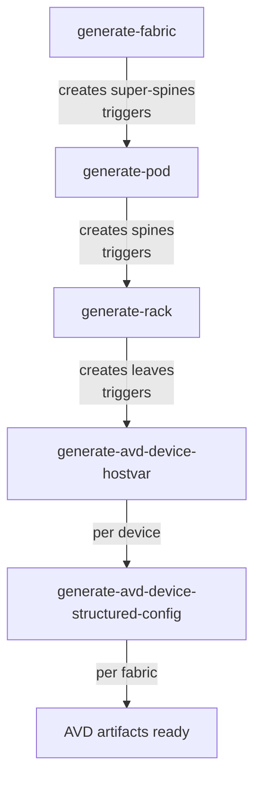

# Provision Your First Fabric

Prerequisites: [Quick Start](./quick-start.md) complete — Infrahub is running at `http://localhost:8000`, and seed data (fabrics, pods, racks, device types, IP pools) is loaded.

At this point you have fabrics defined but **no devices**. This page walks you through generating the devices, cabling, hostvars, and configurations for `Fabric-A`.

## The generator chain

The project ships four generators that must run in a specific sequence. You trigger the first one; each subsequent generator is triggered automatically by the previous one finishing.

| Step | Generator | What it creates |
|------|-----------|-----------------|
| 1 | **generate-fabric** | Super-spine switches, allocates IP pools from `FabricSupernetPool` |
| 2 | **generate-pod** | Spine switches for each pod |
| 3 | **generate-rack** | Leaf switches for each rack |
| 4 | **generate-avd-device-hostvar** | Per-device pyAVD hostvars (stored in the graph as an `AvdHostvarFile`) |
| 5 | **generate-avd-device-structured-config** | Per-device structured AVD config (stored as `AvdStructuredConfigFile`) |

## Step 1 — Create a branch

Generators can only run on a branch, not on `main`. In the Infrahub UI:

1. Click the branch selector in the top bar (shows **`main`** by default).
2. Click **+ Create branch**.
3. Name the branch something like `generate-fabric-a` and click **Create branch**.

The UI switches to the new branch. Any objects created from here are on the branch and can be reviewed as a proposed change before merging.

## Step 2 — Run the fabric generator

1. In the Infrahub UI, open **Actions → Generator definitions** from the main menu.
2. Find **`generate-fabric`** in the list and click it.
3. In the generator page, click the **Run** button.
4. Select the target fabric (`Fabric-A`) from the dropdown.
5. Click **Run** to start.

Infrahub queues the generator and shows progress. The fabric generator itself takes under a minute.

## Step 3 — Watch the chain run

You don't need to manually trigger the pod, rack, and AVD generators — they are chained via event triggers. In the UI:

1. Open **Actions → Tasks** (or watch the running-task indicator in the navbar).
2. Tasks will appear in this order:
   - `generate-fabric` (1 task, per fabric)
   - `generate-pod` (one per pod in the fabric)
   - `generate-rack` (one per rack in the fabric)
   - `generate-avd-device-hostvar` (one per device created — super-spines, spines, leaves)
   - `generate-avd-device-structured-config` (one task for the whole fabric, runs after all hostvars are ready)

The full chain typically takes a few minutes depending on fabric size.

## Step 4 — Verify devices exist

Once all tasks complete, open **Network → NetworkDevice** in the menu. You should see devices with roles:

- `super_spine` — top of the fabric
- `spine` — one per pod
- `leaf` — one or more per rack

Each device has a BGP ASN, a node ID, a loopback IP, a management IP, and interfaces with IP addresses assigned from the fabric's pools.

## Step 5 — Verify AVD artifacts are rendered

Navigate to any leaf device (e.g. **Network → NetworkDevice → `leaf-pod-A1-1`**) and open the **Artifacts** tab.

You should see:

- **AVD EOS Configuration** — Arista EOS CLI config for the device.
- **AVD Device Documentation** — Markdown documentation for the device.

Open the fabric (**Network → NetworkFabric → `Fabric-A`**) and its **Artifacts** tab to see:

- **AVD Fabric Documentation** — full fabric markdown documentation.

See [Viewing Artifacts](./viewing-artifacts.md) for how to open and download each artifact.

## Step 6 — Merge the branch (optional)

Your work is on the branch you created in Step 1. To promote it to `main`:

1. Switch to **Branches** in the menu and select your branch.
2. Click **Create Proposed Change**.
3. Fill in a name and description and submit.
4. Review and merge the proposed change. Once merged, all devices, cabling, and artifacts become part of `main`.

You can now move on to day-2 workflows: [Add a Network Segment](./how-to/add-network-segment.md), [Add a Server](./how-to/add-server.md), [Create a Tenant](./how-to/create-tenant.md), or [Regenerate a Fabric](./how-to/regenerate-fabric.md).

## If something goes wrong

The most common failures are documented in [Common Issues](./troubleshooting.md):

- The fabric generator completes but no spines or leaves appear.
- A task hangs in "running" state.
- An artifact shows "no structured config available".
